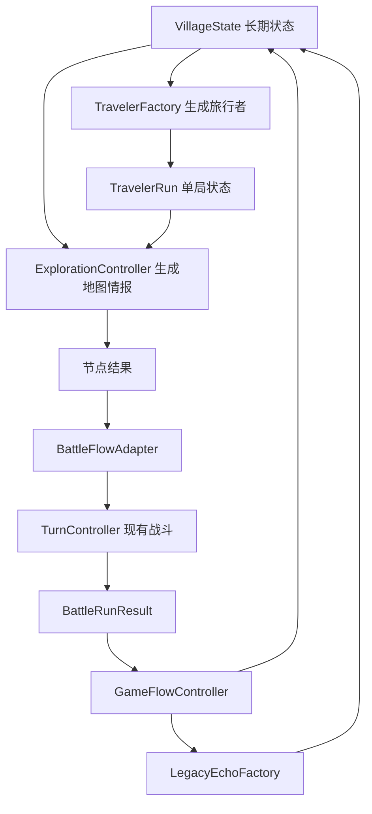

# 技术架构设计文档

## 目标

本文档定义正式开发前的技术边界和模块拆分，确保后续实现 Phase 1 时不会继续把所有逻辑堆入单一脚本。

当前项目是 Unity 工程，已有 2D 卡牌战斗原型。Phase 1 开发应在保留现有战斗可用性的基础上，新增村庄、旅行者、地图情报、前任回声和长期成长模块。

## 当前工程状态

当前核心脚本位于 `Assets/Scripts`：

- `SimpleCardBattle2D.cs`: MonoBehaviour 入口，启动 UI、关卡和新游戏。
- `SimpleCardBattle2D.State.cs`: Inspector 配置、运行时引用和 UI 字段。
- `SimpleCardBattle2D.Battle.cs`: 连接 UI 和 `TurnController`。
- `SimpleCardBattle2D.Stages.cs`: 默认战斗配置和运行时数据创建。
- `SimpleCardBattle2D.UI.cs`: 程序化 UI 构建和刷新。
- `SimpleCardBattle2D.Effects.cs`: 出牌效果表现。
- `SimpleCardBattle2D.Resources.cs`: 资源加载。
- `SimpleCardBattle2D.Utils.cs`: UI 工具方法。
- `CardData.cs`: 卡牌 ScriptableObject。
- `EnemyData.cs`: 敌人 ScriptableObject。
- `StageData.cs`: 关卡 ScriptableObject。
- `BattleConfig.cs`: 战斗配置 ScriptableObject。
- `BattleState.cs`: 战斗运行时状态。
- `DeckRuntime.cs`: 抽牌堆、弃牌堆、手牌运行时容器。
- `TurnController.cs`: 回合、出牌、敌人行动和阶段推进。

现有测试位于：

- `Assets/Tests/Editor/CardBattleRuntimeTests.cs`

现有资源数据位于：

- `Assets/Data/Cards`
- `Assets/Data/Enemies`
- `Assets/Data/Stages`
- `Assets/Data/DefaultBattleConfig.asset`

## 架构原则

- 现有卡牌战斗暂作为可复用子系统，不在 Phase 1 重写。
- 新增系统应与战斗系统通过明确接口交互。
- 长期状态和单局状态分离。
- ScriptableObject 用于静态配置，普通 C# 类用于运行时状态。
- UI 只读取状态和发送命令，不直接承载核心规则。
- 每个模块应能被 Editor Test 覆盖核心逻辑。

## 模块划分

### GameFlow

负责全局流程：

- 从村庄开始新旅行者。
- 进入地图。
- 进入节点。
- 进入战斗。
- 处理战斗结果。
- 处理死亡结算。
- 返回村庄。

建议新增：

- `Assets/Scripts/GameFlow/GameFlowController.cs`
- `Assets/Scripts/GameFlow/GamePhase.cs`

### Village

负责长期状态。

建议新增：

- `Assets/Scripts/Village/VillageState.cs`
- `Assets/Scripts/Village/VillageController.cs`
- `Assets/Scripts/Village/TravelerRecord.cs`

职责：

- 保存训练等级。
- 保存旅行者记录。
- 保存地图情报。
- 保存前任回声。
- 保存已解锁卡牌和牌桌成长进度。

### Traveler

负责当前单局旅行者状态。

建议新增：

- `Assets/Scripts/Traveler/TravelerRun.cs`
- `Assets/Scripts/Traveler/TravelerFactory.cs`

职责：

- 根据村庄状态生成当前旅行者。
- 保存当前生命、牌组、遗物、牌桌能力和探索记录。
- 死亡时提供结算数据。

### Exploration

负责地图情报和节点探索。

建议新增：

- `Assets/Scripts/Exploration/MapNodeIntel.cs`
- `Assets/Scripts/Exploration/MapNodeType.cs`
- `Assets/Scripts/Exploration/MapIntelState.cs`
- `Assets/Scripts/Exploration/ExplorationMap.cs`
- `Assets/Scripts/Exploration/ExplorationController.cs`

职责：

- 生成小型探索地图。
- 显示不可靠情报。
- 结算节点偏差。
- 产出战斗、事件、休息、前任回声或终点结果。

### Legacy

负责前任回声。

建议新增：

- `Assets/Scripts/Legacy/LegacyEcho.cs`
- `Assets/Scripts/Legacy/LegacyEchoFactory.cs`
- `Assets/Scripts/Legacy/LegacyEchoResolver.cs`

职责：

- 根据死亡记录生成前任回声。
- 在地图中提供回声线索。
- 处理立刻吸收和带回村庄研究。

### Table

负责牌桌成长的轻量入口。

建议新增：

- `Assets/Scripts/Table/TableProgress.cs`
- `Assets/Scripts/Table/TableAbility.cs`
- `Assets/Scripts/Table/TableAbilityRuntime.cs`

职责：

- 保存牌桌理解阶段。
- 保存已解锁被动和主动能力。
- 为战斗提供一个被动和一个主动技能入口。

Phase 1 只实现最小能力，不实现完整技能树。

### Battle Adapter

负责把探索流程接到现有战斗。

建议新增：

- `Assets/Scripts/Battle/BattleRunRequest.cs`
- `Assets/Scripts/Battle/BattleRunResult.cs`
- `Assets/Scripts/Battle/BattleFlowAdapter.cs`

职责：

- 将探索节点转换为战斗请求。
- 调用现有 `TurnController` 或战斗场景。
- 将胜利、失败、玩家剩余生命等结果回传给 GameFlow。

## 数据边界

### 静态配置

静态配置优先使用 ScriptableObject：

- 卡牌：`CardData`
- 敌人：`EnemyData`
- 关卡：`StageData`
- 战斗配置：`BattleConfig`
- 后续可新增地图节点配置、事件配置、牌桌能力配置。

### 运行时状态

运行时状态使用普通 C# 类：

- `VillageState`
- `TravelerRun`
- `ExplorationMap`
- `LegacyEcho`
- `TableProgress`
- `BattleState`

### 持久化状态

本文档不决定最终存档介质。实现前需要由用户确认是使用 Unity 本地文件、PlayerPrefs、JSON 存档或其他方案。

在存档介质确认前，Phase 1 可以先实现内存态循环和可调试重置入口。

## 流程图

## UI 架构

Phase 1 UI 采用最小可用原则。

建议新增：

- `Assets/Scripts/UI/VillageView.cs`
- `Assets/Scripts/UI/ExplorationMapView.cs`
- `Assets/Scripts/UI/LegacyEchoView.cs`
- `Assets/Scripts/UI/RunSummaryView.cs`

UI 职责：

- 展示状态。
- 提供按钮触发命令。
- 不直接修改核心状态。

现有 `SimpleCardBattle2D.UI.cs` 可以继续服务战斗界面。后续若战斗接入探索流程，应该逐步把战斗 UI 从完整游戏流程中解耦。

## 测试策略

优先编写 Editor Test 覆盖纯 C# 逻辑：

- 旅行者生成。
- 地图情报偏差。
- 死亡生成前任回声。
- 回声立刻吸收。
- 回声带回研究。
- 村庄长期成长。

现有 `CardBattleRuntimeTests.cs` 应继续保留，新增功能不应破坏已有战斗测试。

## 技术风险

- 现有 `SimpleCardBattle2D` 仍承担 UI 和战斗入口职责，继续扩展会变大。
- 探索流程和战斗流程的边界需要明确，否则死亡结算会耦合到战斗内部。
- 存档介质未确认前，不应把长期状态绑定到具体存储方案。
- 地图情报偏差需要可测试，否则很容易变成难以复现的随机问题。

## Phase 1 开发边界

Phase 1 应实现：

- 内存态村庄状态。
- 新旅行者生成。
- 小型探索地图。
- 前任回声生成与处理。
- 现有战斗接入。
- 最小牌桌能力入口。
- Editor Tests 覆盖核心循环。

Phase 1 不实现：

- 最终存档方案。
- 完整技能树。
- 二阶段敌人规则。
- 真 Boss 时间回溯。
- 最终 UI 美术。
